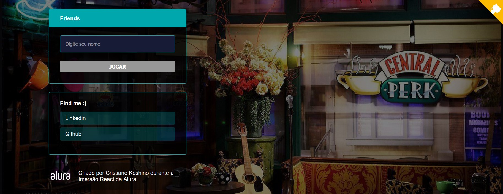

# <p align="center"> QUIZ FRIENDS </p>

<p align="center">

</p>

<p align="center">Developed during Alura - "Imersão React"</p>
<p align="center"><i>Develop a web application with React and Nest.Js</i></p>

# Deploy

* Vercel
  - [https://quiz-friends.kitkoshino.vercel.app/](https://quiz-friends.kitkoshino.vercel.app/)

# :rocket: Technologies

* Next.js
* Javascript
* React js
* Styled Components
#  :video_game: Run Application

### Run application

```bash
    #Install dependencies:
    $ npm install

    # Run application
    $ npm run dev
```